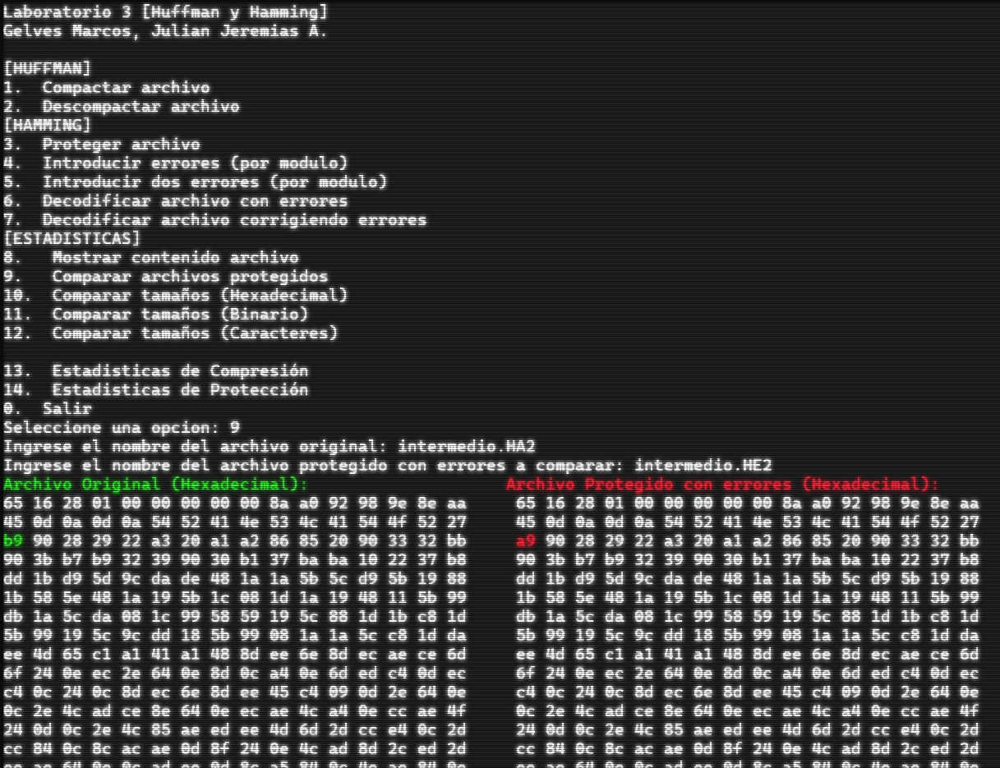

# Lab3 - Data Compression and Error Correction

## Overview

This project is a C-based implementation of fundamental data processing algorithms. It focuses on data compression using Huffman coding, error detection and correction using Hamming codes, and data structure management using Min-Heaps.

## Features

The program provides an easy-to-use menu with the following options:

### Data Compression (Huffman)
- **1. Compress file**: Shrinks a file to make it take up less space.
- **2. Decompress file**: Restores a shrunken file back to its original form.

### Error Protection (Hamming)
- **3. Protect file**: Adds special codes to a file so that any accidental changes can be detected and fixed.
- **4. Introduce one error**: Intentionally damages a file by changing one piece of data, used for testing.
- **5. Introduce two errors**: Intentionally damages a file by changing two pieces of data, used for testing.
- **6. Decode file with errors**: Opens a damaged file to see what it looks like with the errors.
- **7. Decode and correct errors**: Opens a damaged file and uses the special codes to automatically fix the errors.

### Statistics and Tools
- **8. Show file contents**: Displays what is inside a file.
- **9. Compare protected files**: Shows the original file and the damaged file side-by-side to easily spot the differences.
- **10-12. Compare sizes**: Lets you see the size of the files in different formats (Hexadecimal, Binary, or plain Characters).
- **13. Compression Statistics**: Shows a report on how much space was saved by compressing the file.
- **14. Protection Statistics**: Shows a report about the error protection applied to the file.

## Project Structure

- `lab3tic.c`: The main entry point of the application.
- `huffman.h` / `huffmanops.h`: Implementation of the Huffman compression algorithm.
- `hamming.h` / `xhamming.h`: Implementation of Hamming codes for error correction.
- `minheap.h`: Min-Heap data structure logic.
- `utilidades.h`: Common utility and helper functions.

## About the project

This project was made to deepen the understanding of fundamental computer science concepts, specifically data compression and error correction algorithms and low-level memory management in C.
